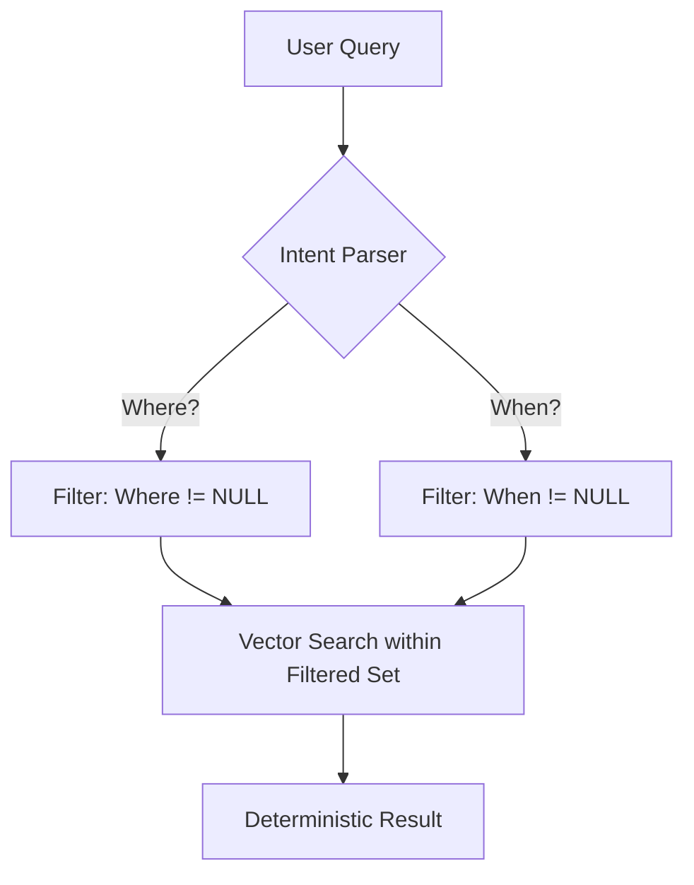

# The Vector Retrieval Fallacy: Why Pure RAG is Methodologically Flawed

[](https://opensource.org/licenses/MIT)
[](#)

## 🚨 The Critical Realization

Most developers treat RAG (Retrieval-Augmented Generation) as a "Black Box" of semantic similarity. We’ve been told: *If the vector distance is small, the answer is there.* **This is a lie.** Vector matching is **Static Fact Comparison**, while user queries are **Dynamic Intent Solves**. This repository deconstructs why pure vector RAG hits a ceiling and proposes a transition to **5W1H-Structured Intent Routing**.

---

## 1. The Core Paradox: Similarity ≠ Relevance

Vector embeddings measure how much a query *looks like* a document. But in real-world information seeking, the user's core intent is often based on what is **missing** or **wrong** in their query.

### The "Missing Fact" Scenario (Supplement)
* **User Asks:** "When did the AI Summit happen in Shanghai?"
* **The Problem:** The user's query vector is rich in *Who* (AI Summit) and *Where* (Shanghai) but has **zero** data for *When*. 
* **The Fallacy:** Vector search retrieves chunks that mention "AI Summit" and "Shanghai." It doesn't guarantee the chunk actually contains a date. It’s matching the *knowns*, not solving for the *unknowns*.

### The "Misinformation" Scenario (Verification/Dispute)
* **User Asks:** "Is the 2026 Olympics in London?" (Correct answer: Milan/Cortina)
* **The Fallacy:** Because the query is semantically 90% identical to a document about "London Olympics," the vector engine will pull "London 2012" data with high confidence. It prioritizes **semantic overlap** over **logical truth**.


---

## 2. The 5W1H Solution: From "Matching" to "Accounting"

We propose deconstructing both documents and queries into six deterministic slots: **Who, When, Where, What, Why, and How**.

By moving from a single 1536-dimensional "Black Box" vector to a **Multi-Index 5W1H Framework**, we enable:

1.  **Intent Classification (QIC):** Identifying if the user is seeking a missing slot (Supplement), verifying a slot (Verify), or challenging a slot (Dispute).
2.  **Dimension Masking:** If the intent is `Supplement(When)`, we use `Who` and `What` for positioning and treat `When` as a **Hard Filter** (Exclude chunks where `When == NULL`).
3.  **Conflict Detection:** If the intent is `Verify`, we perform a boolean check between `Query.Slot` and `Doc.Slot` rather than relying on fuzzy similarity.

---


## 3. Proof of Concept (Python Logic)

```python
# Traditional RAG vs. 5W1H Logic

# Doc: "Alice signed the contract in Paris on Jan 28, 2026."
# Query: "Where did Alice sign the contract?"

# --- THE OLD WAY ---
# Similarity scores Alice + Contract + Sign. Paris is just "noise" in the vector.
score = cosine_similarity(query_vector, doc_vector) # 0.92 (High but blind)

# --- THE 5W1H WAY ---
def intent_aware_search(structured_query, database):
    # Knowns: Who="Alice", What="Sign Contract"
    # Unknown (Target): Where=?
    
    results = database.search(
        filters={
            "who": structured_query["who"],
            "what": structured_query["what"],
            "where": {"$exists": True} # THE LOGICAL ANCHOR
        }
    )
    return results

## 📊 Benchmarking & Data
We don't just claim 5W1H is better; we measure it. 
* See our [Vector Fallacy Golden Set](https://github.com/nickhuang99/Intent-Aware-RAG/wiki/Dataset-Vector-Fallacy-Golden-Set) for the test queries.
* View the [Benchmarking Framework](https://github.com/nickhuang99/Intent-Aware-RAG/wiki/Benchmarking-Framework) to see how we eliminate hallucinations.
